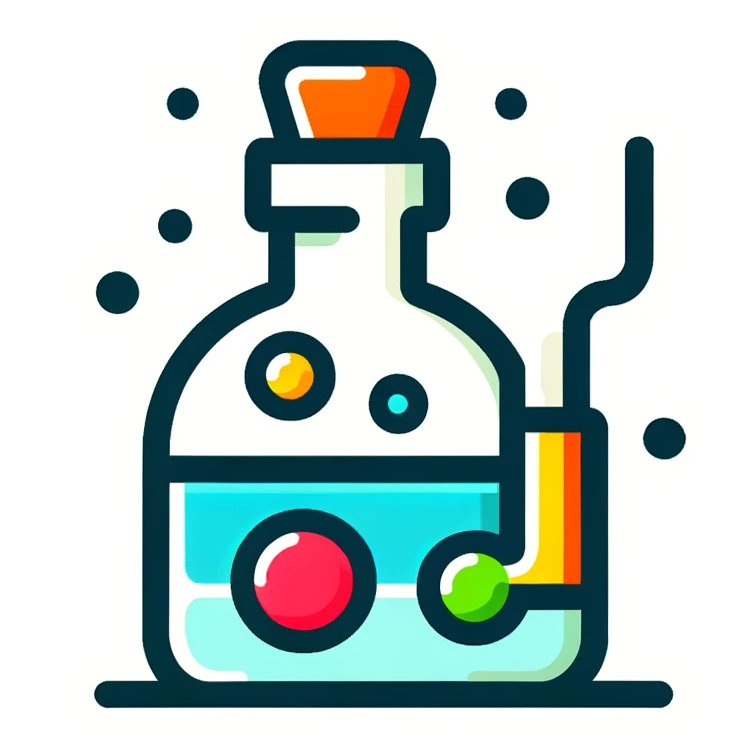

    <h1>
        
    </h1>
    <h3>
        Distiller
    </h3>

Distiller is a "drop-in" feature store project. It aims to generate SQL code using "good" defaults based on existing feature store implementations. 

It demonstrates that you do not need to set up any infrastructure (besides having access to an existing database)
to build machine learning pipelines. 

What it is:

- Just a SQL generation tool, using `sqlalchemy` (for now)
- Support multi-entity (or at least only if each feature group has one single entity, but entity types can be mixed)
- Support feature versioning (or update via a creation timestamp field)

What we aim to do:

- Provide SQL generation tools for offline feature retrieval
- (TODO) Provide SQL generation tools to create a batch online unload onto your favourite online serving tool
- (TODO) Provide an opinionated online serving interface

What we're not:

- Feature metadata store (though providing metadata is optional)
- Compute engine, offload that to a database!

Comparisons and Influences:

- vertex.ai for the data preprocessing standards. No need to support every possible pattern!
- feast community for the SQL templates

Future Ideas:

- The logic is fairly simple and can be ported away (i.e. not in Python). Perhaps we can move the logic to something else and then expose appropriate bindings to R, JavaScript, Java etc.